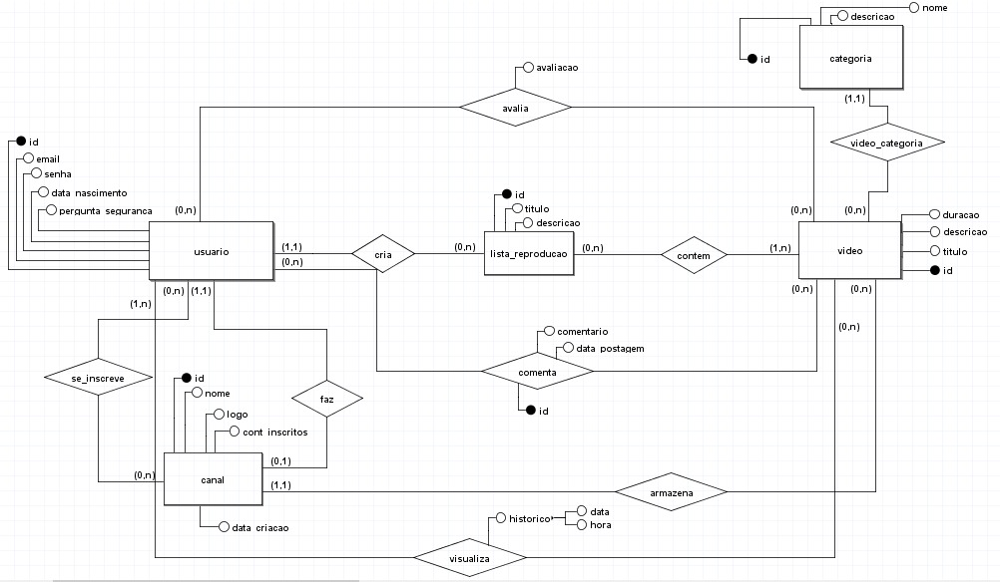
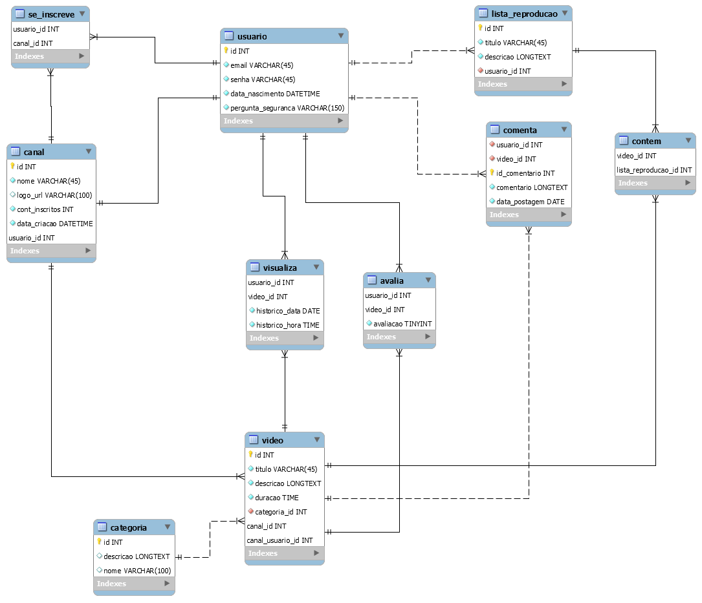

# PROJETO BANCO MySQL - PLATAFORMA DE STREAMING 
## Integrantes: Karine Cunha, Lucas Guimarães, Lucas Melo 

### <b>Enunciado</b>
É necessário construir um banco de dados para armazenar as infomações de uma plataforma de stream e vídeos on demand. Nesta plataforma, os usuários se cadastram e possuem email, senha, data de nascimento e uma pergunta de segurança. Além disso, cada usuário pode criar listas de reprodução com determinados vídeos (seus ou de outros usuários), e é necessário armazenar o histórico dos vídeos assistidos. Por fim, o usuário pode criar um canal para armazenar seus vídeos, além de ser possível se
inscrever nos canais de outros usuários.
Cada canal criado possui um proprietário, que deve ser um usuário registrado. Além disso, o canal possui um nome, uma logo, um contador de inscritos, e uma data de criação.
Os usuários podem fazer upload de vídeos ou começar transmissões ao vivo em seus canais. Cada vídeo/transmissão tem um título, uma descrição, uma duração e uma categoria. As categorias são cadastradas e fornecidas como opções pela própria plataforma.
Finalmente, cada vídeo/transmissão pode ser avaliada e receber comentários. Cada usuário pode avaliar um determinado vídeo apenas uma vez, como positivo ou negativo. No entanto, os usuários podem enviar vários comentários para o mesmo vídeo.

<i><b>OBS: Esse projeto foi desenvolvido durante a disciplina de banco de dados ministrada pelo professor Luan Soares no CEFET-MG campus de Leopoldina.</b></i>

## Diagrama de Entidade e Relacionamento (DER):

## Diagrama de Tabela e Relacionamento (DTR):

## SELECTS exemplos:
 No arquivo <a href="./relatorio-selects-plataforma-streaming.pdf" target="_blank">relatorio-selects-plataforma-streaming.pdf</a> existem várias possíveis consultas de SELECT como exemplo e em diferentes graus de complexibilidade.
 
### Softwares Utilizados:
<ul>
    <a href="https://sourceforge.net/projects/brmodelo/" target="_blank"><li>BrModelo para diagramas MER-DER</li></a>
    <a href="https://www.mysql.com/products/workbench/" target="_blank"><li>MySQL WorkBench para diagramas DTR</li></a>
</ul>